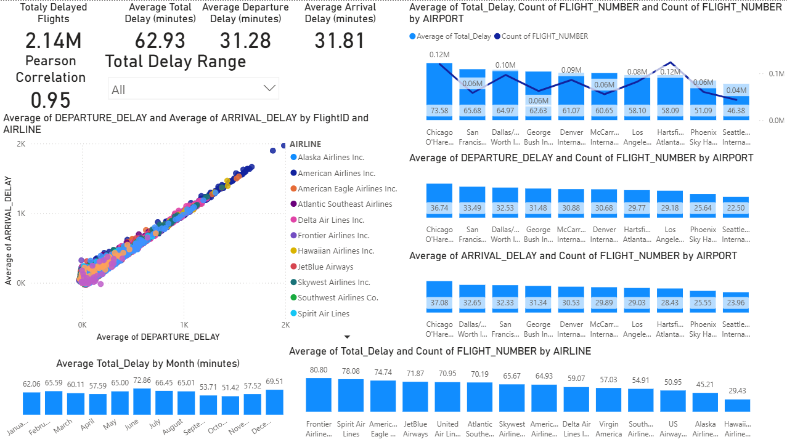
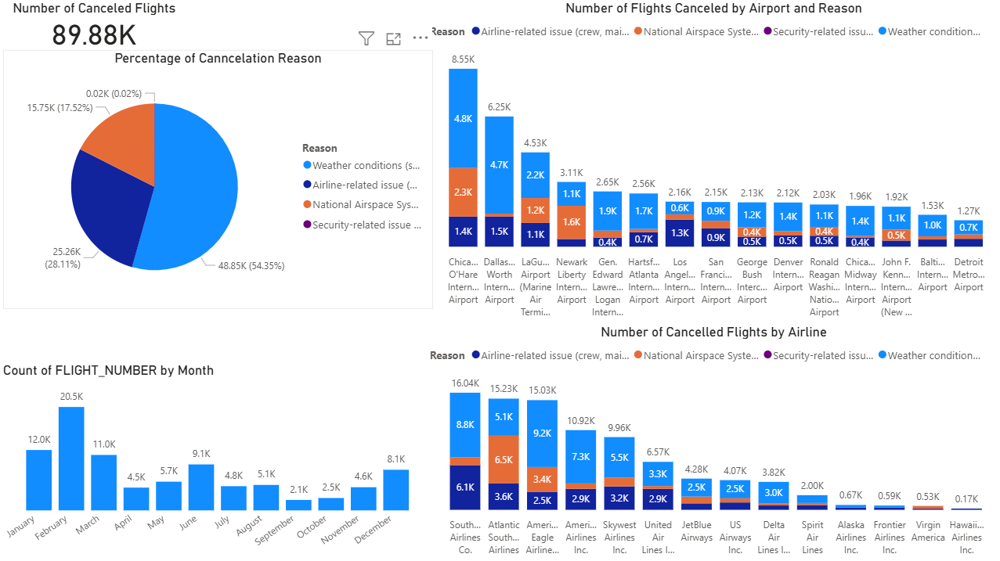

# ✈️ Flight Performance Analysis – Power BI Dashboard (2015)


---

## 📊 Project Overview
This repository contains a Power BI report analyzing U.S. domestic flight operations for 2015.  
The dataset includes **5.82 million flights**, covering **322 airports** and **14 airlines**, with detailed operational attributes such as delays, cancellations, taxi times, and disruption causes.

The report consists of three analytical pages:
1. **Intro – Dataset Summary**
2. **Totally Delayed Flights Analysis**
3. **Canceled Flights Analysis**

---

## 1. Intro – Dataset Summary & High-Level Metrics
This page provides a macro-level overview of the dataset and key operational indicators:

- **Total Flights:** 5.82M  
- **Average Scheduled Flight Time:** 141.69 minutes  
- **Average Total Delay:** 13.76 minutes  
- **Delayed Flights:** 36.86%  
- **Non‑Delayed Flights:** 63.14%

Additional breakdowns:
- **Top Airlines by Volume:** Southwest, Delta, American  
- **Top Origin Airports:** ATL, ORD, DFW  
- **Monthly Flight Distribution:** Stable throughput with a peak in July  

This page establishes the baseline for understanding overall traffic and performance patterns.

---

## 2. Totally Delayed Flights Analysis
This page isolates delayed flights and examines delay behavior in depth.

### Key Metrics
- **Total Delayed Flights:** 2.14M  
- **Average Total Delay:** 62.93 minutes  
- **Average Departure Delay:** 31.28 minutes  
- **Average Arrival Delay:** 31.81 minutes  
- **Correlation (Dep vs Arr Delay):** Pearson r = 0.95  

### Operational Insights
- **Airlines with Highest Average Delay:** Frontier, Spirit, American Eagle  
- **Airports with Highest Delay Impact:** ORD, SFO, DDF  
- **Month with Highest Average Delay:** June  

This page highlights systemic delay patterns and identifies high‑impact carriers, airports, and seasonal effects.

---

## 3. Canceled Flights Analysis
This page focuses on cancellation behavior and root causes.

### Key Metrics
- **Total Canceled Flights:** 89.88K  

### Cancellation Causes
- **Weather:** 54.35%  
- **Airline Related:** 28.11%  
- **National Airspace System:** 17.52%  
- **Security:** 0.02%  

### Operational Breakdowns
- **Airports with Most Cancellations:** ORD, DFW, LGA  
- **Airlines with Most Cancellations:** Southwest, Atlantic Southeast, American Eagle  
- **Month with Most Cancellations:** February  

This page quantifies operational disruptions and identifies the primary drivers behind cancellations.

---

## 🛠️ Tools & Technologies
- **Power BI Desktop** – Data modeling, DAX, interactive visualization  
- **Power Query (M)** – Data cleaning and transformation  
- **Excel/CSV** – Initial data inspection and preprocessing  

---

## 📘 How to Use the Report

### 1. Navigation
The report includes three pages accessible via the bottom navigation bar:
- Intro  
- Totally Delayed Flights Analysis  
- Canceled Flights Analysis  

### 2. Filters & Slicers
Available slicers:
- Cancellation Status  
- Delay Status  
- Diversion Status  

Users can:
- Select categories  
- Compare filtered vs unfiltered performance  
- Combine filters to isolate specific scenarios  

### 3. Interacting with Visuals
All visuals support:
- **Cross‑filtering**  
- **Tooltips**  
- **Drill‑down** (where applicable)

### 4. Analytical Use Cases
The report supports:
- Identifying high‑delay airlines and airports  
- Examining seasonal patterns  
- Quantifying impact of weather vs airline issues  
- Comparing performance across carriers or airports  
- Assessing correlation between departure and arrival delays  

### 5. Exporting Insights
Users may export:
- Summaries  
- Filtered tables  
- Visual snapshots  

---

## 🎯 Objective
The primary objective of this analysis is to:
- Evaluate operational performance across airlines and airports  
- Identify delay and cancellation patterns  
- Quantify the impact of disruption factors  
- Provide data‑driven insights for operational optimization and strategic planning  

---

## 📸 Report Screenshots

Below are sample screenshots from the Power BI dashboard for quick preview.

### 1. Intro – Dataset Summary


### 2. Totally Delayed Flights Analysis


### 3. Canceled Flights Analysis


> All screenshots are static previews.  
> For full interactivity, download the PDF or open the PBIT template.

---

## 📦 Dataset Source
The original dataset used in this project consists of three files provided by the U.S. Department of Transportation and hosted on Kaggle.  
Due to their large size (5.82M records), they are not included in this repository.

Original Kaggle dataset:  
https://www.kaggle.com/datasets/usdot/flight-delays

**Kaggle files:**
- `airlines.csv` – Airline codes and names  
- `airports.csv` – Airport codes, names, and locations  
- `flights.csv` – Full flight-level dataset (5.82M rows)

---

## 📁 Data Files Included in This Repository
The following supporting files were used during data cleaning, modeling, and visualization.  
These files are included in the repository for reproducibility:

- `codes_category.csv` – Mapping of cancellation/diversion codes to descriptive categories  
- `days.csv` – Lookup table for day names  
- `months.csv` – Lookup table for month names  

These files were used to enrich the dataset and support the Power BI data model.

---

## 📂 Project Structure
```
Project2_Flight-Performance-Analysis/
│
├── README.md                     # Full project documentation
├── Flight_Analysis_Template.pbit # Power BI template (no data)
├── Flight_Analysis.pdf           # Static PDF export of the report
│
├── data/                         # Supporting data files used in the model
│   ├── codes_category.csv
│   ├── days.csv
│   ├── months.csv
│
├── screenshots/                  # Report preview images
│   ├── intro_page.png
│   ├── delayed_flights_page.png
│   ├── canceled_flights_page.png
│
└── (Kaggle dataset not included due to size)
```

